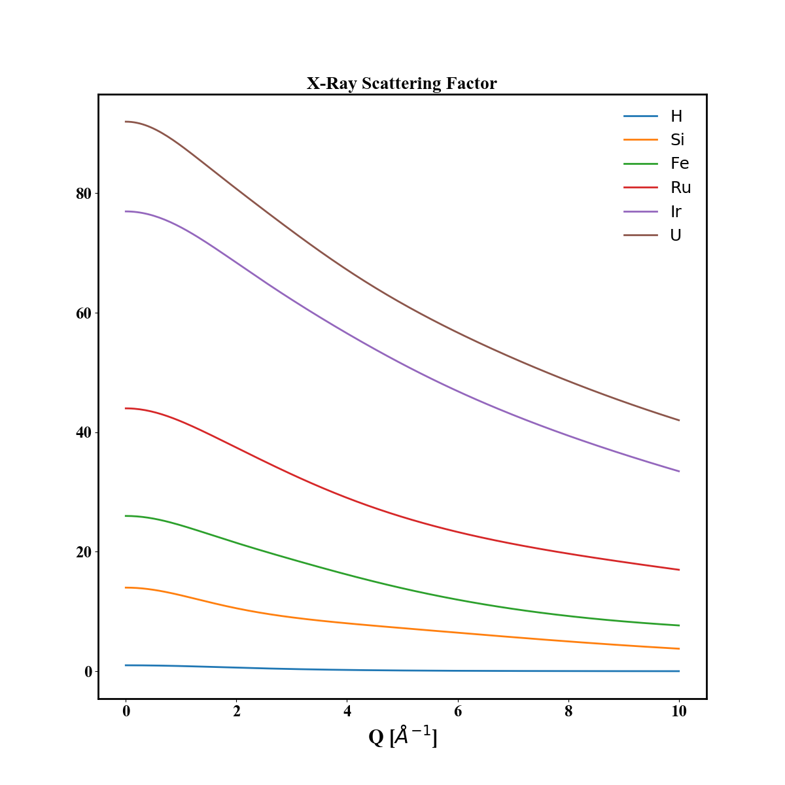

# Dans_Diffraction
## Atomic Properties Data
This folder contains atomic properties data used by Dans_Diffraction programs.

Full code documentation available [here](https://danporter.github.io/Dans_Diffraction/).

For comments, queries or bugs - email dan.porter@diamond.ac.uk


### Instructions
```text
$ ipython -i -m Dans_Diffraction
```

```python
>> import Dans_Diffraction as dif
>> print(dif.fc.atom_properties('Co', 'Weight'))
>> print(dif.fc.print_atom_properties('Fe'))
>> a = dif.fc.atom_properties() # table of all properties
```


### Datasources
The data is taken from a number of sources:
* Neutron scattering lengths: [NIST](http://www.ncnr.nist.gov/resources/n-lengths/)
* X-ray Form factor: [ITC](https://it.iucr.org/C/), p578
* Magnetic Form Factor: [ILL](https://www.ill.eu/sites/ccsl/ffacts/ffactnode4.html)
* Element weights and radii: [Wikipedia](http://en.wikipedia.org/wiki/List_of_elements_by_atomic_properties)
* X-ray edges: [x-ray database](http://xdb.lbl.gov/Section1/Table_1-1.pdf)
* Electron configurations: [Wikipedia](https://en.wikipedia.org/wiki/Electron_configurations_of_the_elements_(data_page))


### X-Ray Form Factors
X-Ray form factors calculated using the analytical form from the International Tables of Crystallography Vol. C, 
[Table 6.1.1.4](https://it.iucr.org/Cb/ch6o1v0001/table6o1o1o4.pdf).

For a particular reciprocal wave-vector (units of inverse angstroms), the form factor f(|Q|) can be calculated:

```python
q = np.arange(0,6,0.01)
f = dif.fc.xray_scattering_factor('Fe', Qmag=q)
```

