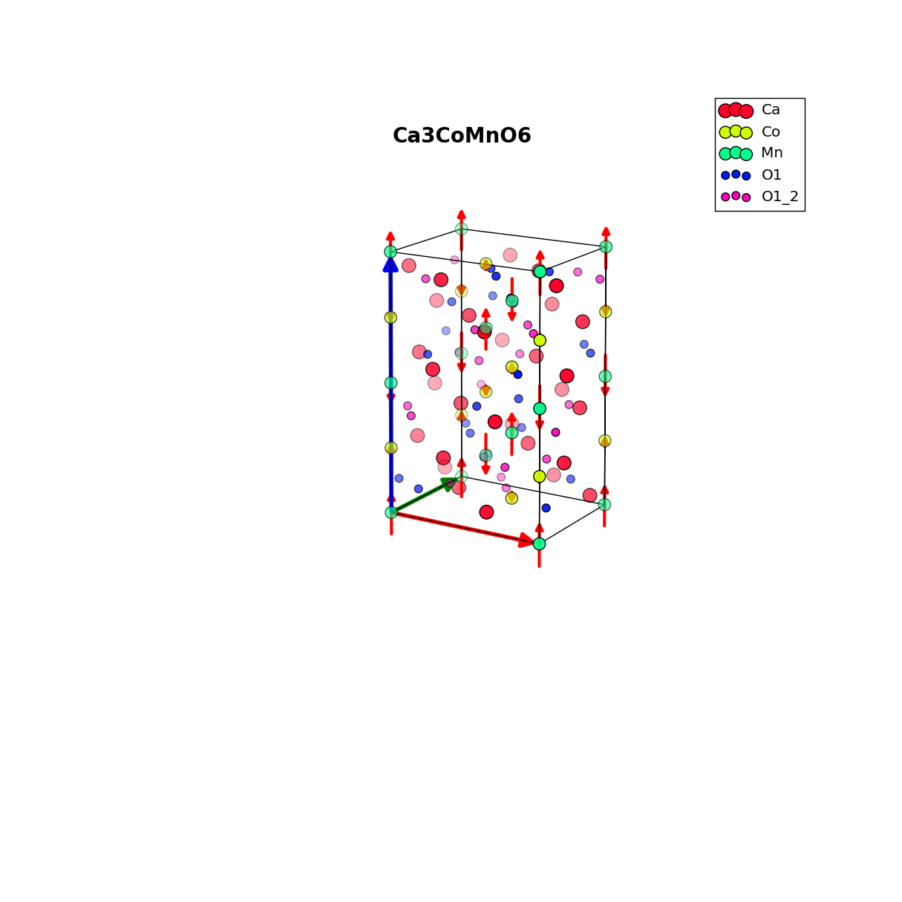
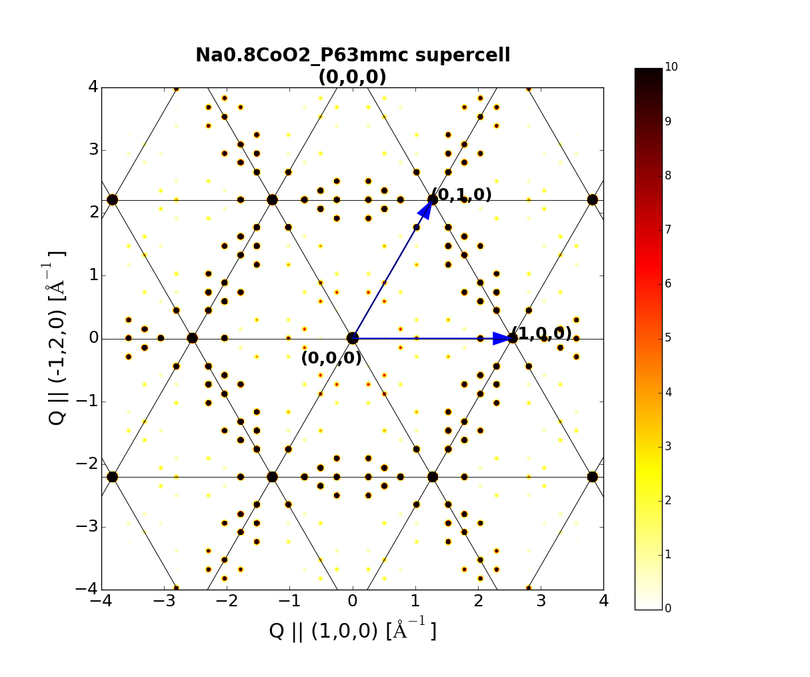
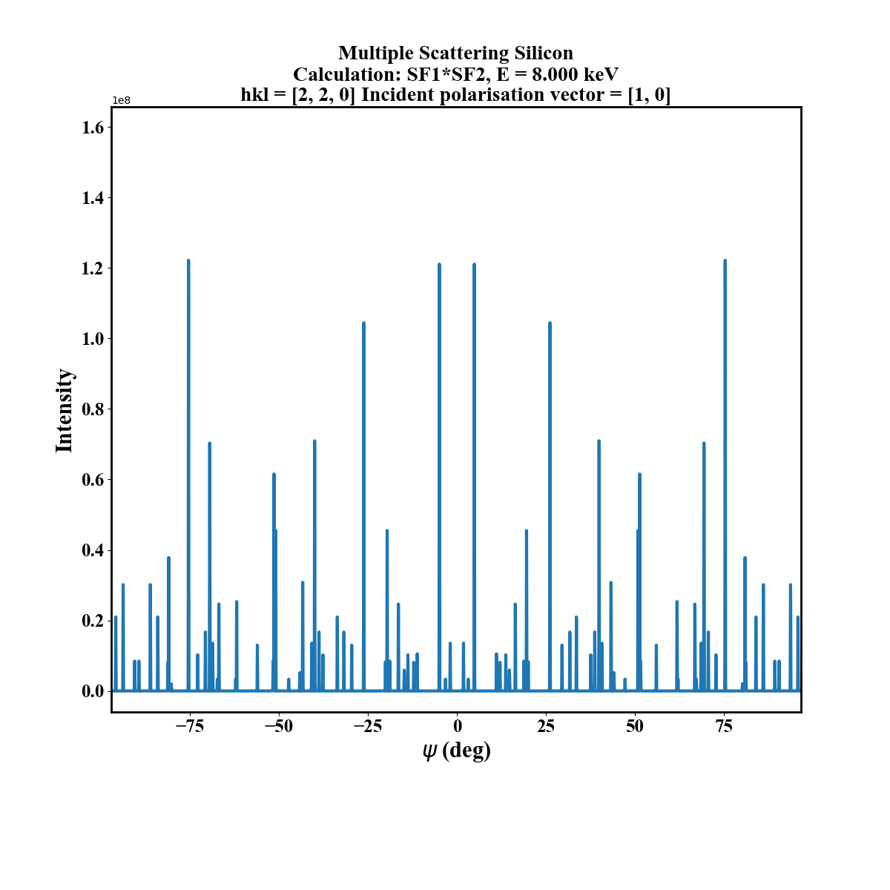
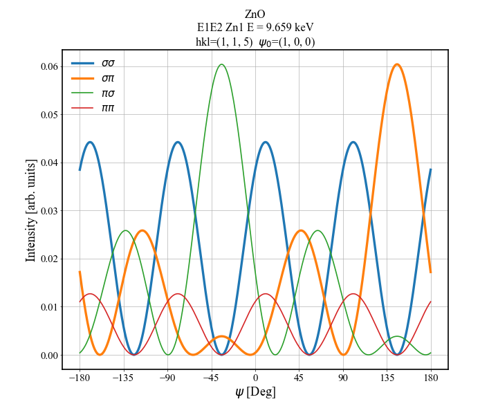
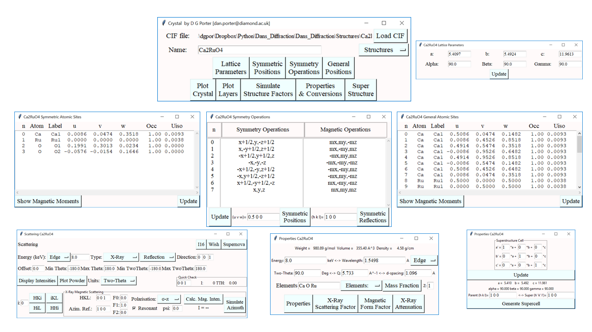
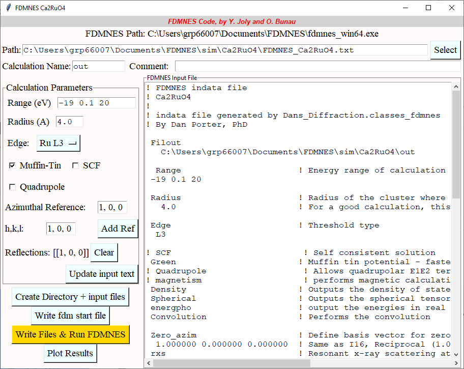
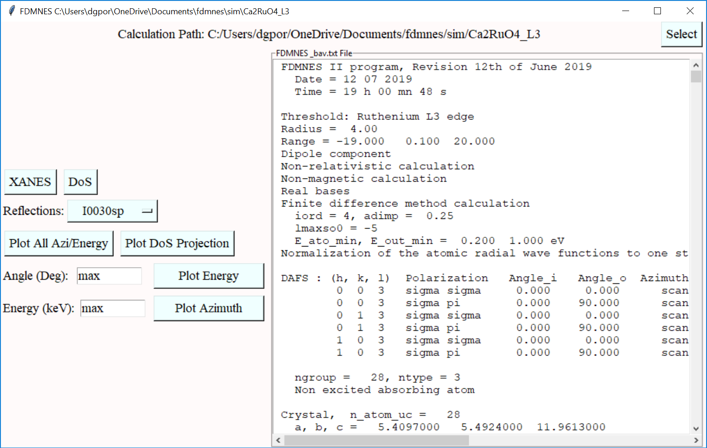

# Dans_Diffaction
Reads crystallographic cif files and simulates diffraction

**Version 1.6**

By Dan Porter, Diamond Light Source
2020

#### TL;DR:
```text
$ ipython -i -m Dans_Diffraction
```

```python
import Dans_Diffraction as dif
xtl = dif.Crystal('some_file.cif')
xtl.info() # print Crystal structure parameters

# Print reflection list:
print(xtl.Scatter.print_all_reflections(energy_kev=5)) 

# Plot Powder pattern:
xtl.Plot.simulate_powder(energy_kev=8)
plt.show()

# Start graphical user interface:
xtl.start_gui()
```

Full code documentation available [here](https://danporter.github.io/Dans_Diffraction/).

For comments, queries or bugs - email dan.porter@diamond.ac.uk

# Installation
**Requirements:** 
Python 2.7+/3+ with packages: *Numpy*, *Matplotlib*, *Scipy*, *Tkinter*

Stable version from PyPI:
```text
$ pip install Dans-Diffraction
```

Latest version from GitHub:
```text
$ git clone https://github.com/DanPorter/Dans_Diffraction.git
```

# Operation
Dans_Diffraction is best run within an interactive python environment:
```text
$ ipython -i -m Dans_Diffraction
```

Dans_Diffraction can also be run in scripts as an import, example scripts are provided in the [Examples](Examples) folder.
### Read CIF file
```python
import Dans_Diffraction as dif
xtl = dif.Crystal('some_file.cif')
xtl.info() # print Crystal structure parameters
```

### Alter atomic positions
```python
xtl.Cell.latt([2.85,2.85,10.8,90,90,120]) #  set lattice parameters
xtl.Atoms.info() # Print Symmetric positions
xtl.Structure.info() # Print All positions in P1 symmetry (same structure and functions as xtl.Atoms)
# Symmetric positions
xtl.Atoms.changeatom(idx=0, u=0, v=0, w=0, type='Co', label='Co1')
xtl.Atoms.addatom(idx=0, u=0, v=0, w=0, type='Co', label='Co1')
# After adding or changing an atom in the Atoms class, re-generate the full structure using symmetry arguments:
xtl.generate_lattice()
# Full atomic structure in P1 symmetry
xtl.Structure.changeatom(idx=0, u=0, v=0, w=0, type='Co', label='Co1')
xtl.Structure.addatom(idx=0, u=0, v=0, w=0, type='Co', label='Co1')
# Plot crystal Structure
xtl.Plot.plot_crystal() # 3D plot
xtl.Plot.plot_layers() # 2D plot for layered materials
```



### Alter crystal symmetry
```python
xtl.Symmetry.info() # print symmetry arguments
xtl.Symmetry.addsym('x,y,z+1/2') # adds single symmetry operation
xtl.Symmetry.changesym(0, 'x,y,z+1/4')
# After adding or changing symmetry operations, regengerate the symmetry matrices
xtl.Symmetry.generate_matrices()
```

### Calculate Structure Factors
X-ray or neutron structure factors/ intensities are calculated based on the full unit cell structure, including atomic 
form-factors (x-rays) or coherent scattering lengths (neutrons).
```python
# Choose scattering options (see help(xtl.Scatter.setup_scatter))
xtl.Scatter.setup_scatter(type='x-ray', energy_keV=8.0)
# Allowed radiation types:
#    'xray','neutron','xray magnetic','neutron magnetic','xray resonant'
xtl.intensity([h,k,l]) # Returns intensity
xtl.print_all_refelctions() # Returns formated string of all allowed reflections
# Plot Experimental Intensities
xtl.Plot.simulate_powder() # Powder pattern
xtl.Plot.simulate_hk0() # Reciprocal space plane
```



Magnetic scattering is also available for neutrons and x-rays (both resonant and non-resonant), using the appropriate magnetic form-factors.
```python
Imag = xtl.Scatter.magnetic_neutron(HKL=[0,0,3])
Ires = xtl.Scatter.xray_resonant_magnetic(HKL=[0,0,3], energy_kev=2.838, azim_zero=[1, 0, 0], psi=0, polarisation='s-p', F0=0, F1=1, F2=0)
```

### Multiple Scattering
Simulations of multiple scattering at different azimuths for a particular energy can be simulated. Based on code by Dr Gareth Nisbet.

```python
azimuth, intensity = xtl.Scatter.ms_azimuth([h,k,l], energy_kev=8)
```



### Tensor Scattering
Simulations of resonant scattering using tensors. Resonant x-ray azimuths can be simulated. Based on code by Prof. Steve Collins.

```python
ss, sp, ps, pp = xtl.Scatter.tensor_scattering('Ru1', [h,k,l], energy_kev=2.838, azir=[0,1,0], psideg=90)
```



### Properties
The Crystal class contains a lot of atomic properties that can be exposed in the Properties class:
```python
xtl.Properties.info()
```

All the properties are stored in the folder Dans_Diffraction/data.

### Superstructures
Superstructures can be built using the Superstructure class, requring only a matrix to define the new phase:
```python
su = xtl.generate_superstructure([[2,0,0],[0,2,0],[0,0,1]])
```

Superstucture classes behave like Crystal classes, but have an additional 'Parent' property that references the original 
crystal structure and additional behaviours partiular to superstructures.

```python
su.parent.info() # Parent structure
su.P # superstructure matrix 
```

### Graphical Front End


Start a new GUI, then select a cif file:
```python
dif.Startgui()
```
Using an already generated crystal:
```python
xtl.start_gui()
```

### FDMNES functionality
FDMNES is a powerful tool for simulating resonant x-ray diffraction, created by [Y. Joly and O. Bunau.](http://neel.cnrs.fr/spip.php?rubrique1007&lang=en)

The Dans_Diffraction FDMNES class allows for the automatic creation of input files and simple analysis of results.
The following command should be used to activate these features (only needs to be issued once). 
```python
dif.activate_fdmnes()
```
Once activated, the FDMNES classes become available.
```python
fdm = dif.Fdmnes(xtl) # Create input files and run FDMNES
fdma = dif.FdmnesAnalysis(output_path, output_name) # Load output files and plot results
```
See class documentation for more information.


Once activated, FDMNES GUI elements become available from the main window, emulating functionality of the classes.



